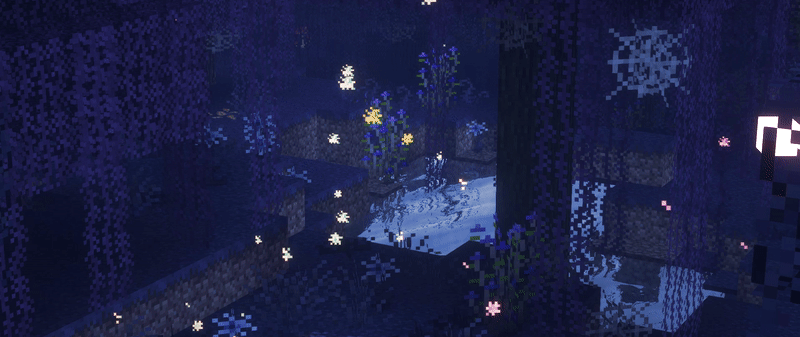

## 👋 Привет!
- Это мой профиль, где я делюсь своими проектами и достижениями. Надеюсь, найдёшь что-то интересное для себя. Приятного просмотра!

  

## 👨‍🎓 Обо мне
- **Нахожусь**: Москва, Россия
- **Студент:** Второй курс НИТУ МИСиС
- **Направление:** БИВТ (Информатика и вычислительная техника)
- **Работаю над разработкой микросервисов и Telegram-ботов**
- **Увлекаюсь графическим дизайном**
  
## 🛠 Технический стек

### 👨‍💻 Языки программирования

### 💾 Базы данных

### 🔧 Инструменты

## 🚀 Мои проекты  

- **OFV** — Интеллектуальный чат-бот для анализа одежды на фотографиях и поиска похожих товаров на Wildberries. Микросервисная архитектура с использованием React, Go, Python, ML-моделей (Gemini API) и RAG.  
  [Репозиторий проекта](https://github.com/Soln1shko/OFV)  

- **AuthMicro** — Микросервис для управления аутентификацией и авторизацией пользователей, написанный на Go. Предоставляет RESTful API для регистрации, входа, обновления токенов и проверки прав доступа.  
  [Репозиторий проекта](https://github.com/Soln1shko/AuthMicro)  

- **OmniChat** — Универсальный Telegram-бот с поддержкой нескольких моделей искусственного интеллекта (Gemini, Claude, DeepSeek).  
  [Репозиторий проекта](https://github.com/Soln1shko/OmniChat)  

- **TaskFlow** — это простой сервис для обработки асинхронных задач, написанный на Go. Он использует Redis для организации очереди задач.  
  [Репозиторий проекта](https://github.com/Soln1shko/TaskFlow)  

## 🌟 Контакты

- **Почта**: [Напиши мне на почту!](mailto:gitgosurf@outlook.com)  
  *Есть вопросы или идеи? Пиши, я всегда рад новым сообщениям!*  

## 🎵 Сейчас играет

  

---

## :fire: Моя статистика :

  

